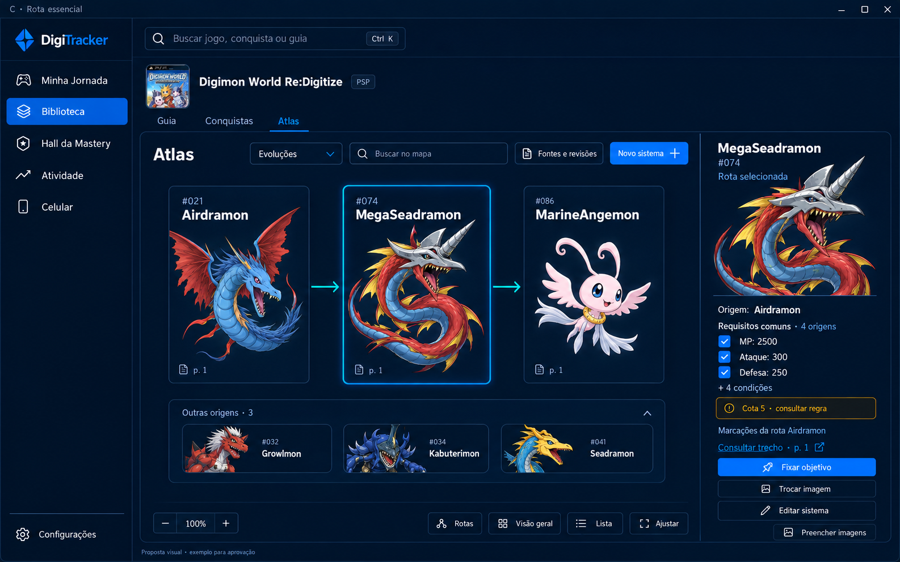
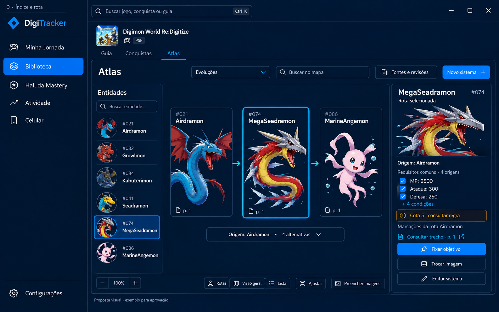

# Atlas C+D

Esta entrega combina a rota essencial da proposta C com o índice pesquisável da
proposta D. As imagens abaixo são referências conceituais; nomes, requisitos e
imagens da interface sempre vêm dos dados do usuário.

## Contrato implementado

- O modo padrão é **Rotas** e mostra no máximo três cartões: origem, entidade
  selecionada e destino. Alternativas ficam em chips recolhidos.
- Ao entrar novamente no Atlas, a seleção válida é preservada, mas a
  apresentação volta a **Rotas**; uma Visão geral congestionada nunca é
  restaurada automaticamente.
- O índice mantém todas as entidades pesquisáveis por nome ou `#ID`, com
  miniatura, estágio e número do cartão; abaixo de 920 px ele recolhe e abre
  como painel sobreposto.
- **Visão geral** mostra todos os cartões filtrados, mas somente conexões
  incidentes à entidade selecionada. **Lista** remove o diagrama sem remover
  informação.
- O inspetor sempre identifica a rota marcada. Requisitos comuns são apenas
  agrupados visualmente; IDs e marcações continuam por relação.
- Células com múltiplos links não são alternativas por inferência. Combinações,
  transformações por item e semântica desconhecida permanecem classificadas e
  podem gerar pendência. Itens nunca viram entidades.
- A interpretação estruturada usa `ATLAS_EXTRACTION_VERSION = 6`. A captura
  original e a publicação anterior permanecem recuperáveis durante
  reprocessamento/aprovação.
- Sistemas antigos agora têm **Reprocessar fonte salva**. O comando lê o PDF
  preservado (ou reutiliza o JSON de GameFAQs/Web Archive), aplica a separação
  conservadora de entidades e abre uma prévia vinculada ao mesmo sistema. A
  publicação anterior, IDs, imagens, marcações e objetivo só são trocados após
  aprovação; fusões e listas ambíguas aparecem como pendências identificáveis.

## Verificação local

Os testes sintéticos cobrem o cartão composto `#104`, IDs e imagens preservados,
itens, fusões, cotas ambíguas, alternativas, ciclos, seleção e responsividade.
O smoke visual gera capturas em `build-check/atlas-ui-smoke/` para 1600×900,
1280×720 e 820×900. Capturas completas de fontes externas não são versionadas.

Para revisão manual, abra [`tests/atlas-cd-test.html`](../tests/atlas-cd-test.html)
com o servidor estático. Essa é a fixture visual canônica e o smoke principal
correspondente é `tests/atlas_cd_fixture_smoke.cjs`; ambos usam os módulos reais
de apresentação do Atlas.

As capturas da implementação usadas na revisão estão em
[`docs/screenshots/atlas-cd/`](screenshots/atlas-cd/): rota desktop em duas
resoluções, lista estreita e diálogo de preenchimento de imagens.
